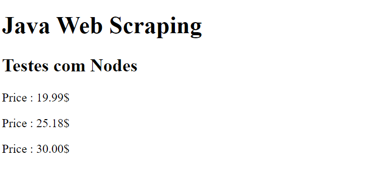

# Java-Web-Scraping-Book

<h3>Expressoes Regulares</h3>
<ul>
<li><strong>/padrao/</strong> sintaxe para criacao de uma expressao regular no Javascript, dentro das barra a palavra 'padrao' deve ser subistituida pela expressao regular real.</li>
</ul>

<strong>match(), search(), replace(), split() e outros metodos aceitam expressoes regulares.</strong>

<ul>
    <li><strong>document.head.childNodes.length </strong> retorna o total de nos do DOM;</li>
    <li><strong>document.head.childNodes.length </strong> retorn o total de nos do DOM;</li>
</ul>
<h3>Estudos de Java Web Scraping com base no livro <emph>JAVA WEB SCRAPING HANDBOOK</emph></h3> 

1-Extrair com o uso de expressao regular todos os valores (Price) presentes na página HTML.  

Pagina 23 do livro contém uma tabela com o padrão para o uso de expressoes regulares

Campo preco conforme definido na página 24 do livro.

1- Obter os titulos, numero de comentarios, numero de votos positivos com base na pagina <a href="https://news.ycombinator.com">ycombinator</a>.  

